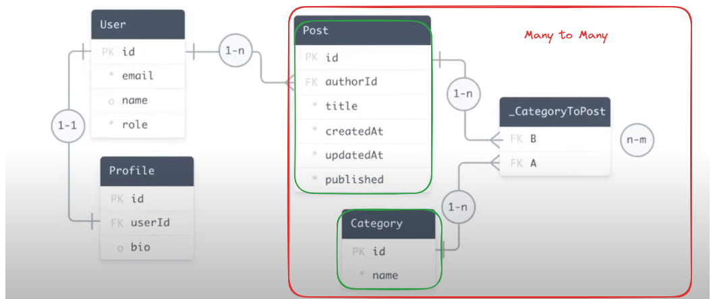

## Learing Prisma ORM

### Data Models | Relationships | Aggregation | Migrations | Paginations and more...

#### Important before starting project:

- Databases are running in a docker container.
- Data directory will be created automatically. just run the `docker compose up` command.

#### 1. How to define data models inside prisma.schema file?

We have 2 ways to define data models inside prisma.schema file.

1. **Introspection**: We already have a database and tables ready, and we create our prisma model file based on the existing database tables.

   ```bash
   # we use following command to introspect the database and create the prisma schema file.
   npx prisma db pull
   ```

2. **Migration**: We can define the data models manually inside the schema file, and we run migration to create the tables in the database.

   ```bash
   # create the models inside the prisma.schema file, then run the following commands for migrations.

   # https://www.prisma.io/docs/orm/prisma-migrate/workflows/development-and-production

   # dev is for development environment
   npx prisma migrate dev --name <name_here>
   ```

#### 2. How to define relationships between the data models?

We can following relationships in the prisma schema file.

**One-to-One Relationship**:

- Every user can have 0 or atmost one Profile. `User.id - Profile.userId`

```prisma
model Profile {
  userId Int     @unique // each profile points to unique user
  user User @relation(fields: [userId], references: [id])
}

model User {
  Profile Profile? // user can have 0 or atmost 1 profile

}
```

**One-to-Many Relationship**:

- The ERD represents every user can have 0 or multiple Post. `User.id -> Post.authorId`. which is called optional one-to-many relationship, but if we think in the real world, we can't create a post and keep it's author NULL. (think of it as anonymous post). Thus, we have to create strict one-to-many relationhip in the schema.

```prisma
model Post {
  authorId  Int
  author User @relation(fields: [authorId], references: [id])
}

model User {
   Post Post[]
}
```

**Many-to-Many Relationship**:

- Many to Many relationship is when 1 or more records of one table connects to 1 or more records of another table. It is represented by creating a new table that holds the foreign keys of both tables.
- A post can has multiple Category and a Category can be associated with multiple posts. `Post.id <-> Category.id`

- In primsa, many to many relationship can be created in 2 ways:

  1. **Explicit**: We create a new table that holds the foreign keys of both tables.
  2. **Implicit**: We use the `@relation` attribute to create the many-to-many relationship. We are using implicit in schema file.

```prisma
// we dont need to have @relation attribute, but in DB, we will have a new table called _CategoryToPost in database but not in our prisma.
model Category {
  Posts Post[]
}

model Post {
    Categories Category[]
}
```

**ERD Diagram**:



#### 2. How to Seed data in Prisma?

We have created a `seed.ts` file inside prisma directory. Add the following code

```json
// package.json
prisma: {
    "seed": "ts-node ./prisma/seed.ts", // for node.js
    "seed": "ts-node --compiler-options {\"module\":\"CommonJS\"} prisma/seed.ts" // for next.js

}
```

#### 3. Filter Queries by Operators in Prisma?

```typescript
// find all posts
const posts = await prisma.post.findMany();

// find only first post
const post = await prisma.post.findFirst();

// find post by id
const post = await prisma.post.findUnique({
  where: {
    id: 1,
  },
});

// find all posts by filers
const posts = await prisma.post.findMany({
  where: {
    id: {
        in: [1,2,3] // will fetch user with id 1, 2, 3 (3 users)
        // notIn: [1,2]
        not: {
            in: [1,2] // just like the above. will fetch all users except 1, 2
            gt: 4, // will fetch all users with id not greater than 4

        }
    }
    name: "author", // we can use authorId or author
    name: {
      startsWith: "J",
      endsWith: "D",
      contains: "A",
    //   and so many more
    },
  },
});

// find all post where title contains 'Github' OR 'Twitter' AND the post are published
const posts = await prisma.post.findMany({
  where: {
    OR: [
      {
        title: {
          contains: "Github",
        },
      },
      {
        title: {
          contains: "Twitter",
        },
      },
    ],
    AND: {
        published: true,
    }
  },
});
```

#### 4. Filter Queries by Relation in Prisma?

We can use 5 relation filters:

1. every
2. some
3. none
4. is
5. isNot

```typescript
// find all users who have at least one post
const users = await prisma.user.findMany({
  where: {
    posts: {
      some: {},
    },
  },
});

// find all users that all their posts are published
const users = await prisma.user.findMany({
  where: {
    posts: {
      every: {
        published: true,
      },
    },
  },
});

// find all users with no posts
const users = await prisma.user.findMany({
  where: {
    posts: {
      none: {},
    },
  },
});

// all posts that their author name is John
const posts = await prisma.post.findMany({
  where: {
    Author: {
      is: {
        name: "John",
      },
    },
  },
});

// all posts that their author name is not John but their email contains @gmail
const posts = await prisma.post.findMany({
  where: {
    isNot: {
      name: "John",
    },
    is: {
      email: {
        contains: "@gmail",
      },
    },
  },
});

// IsNot is reverse of Is
```

#### 5. Filter Nested queries in Prisma?

```typescript
// find all posts that their author
const posts = await prisma.post.findMany({
  include: {
    Author: true,
  },
});
```

#### 6. Select fields with query in Prisma?

```typescript
// find all posts with only title and author name
const posts = await prisma.post.findMany({
  select: {
    title: true,
    Author: {
      select: {
        name: true,
      },
    },
  },
});
```

#### 7. What is Aggregation functions in Prisma?

1. count
2. sum
3. avg
4. min
5. max

```typescript
// count all posts likes
const aggregate = await prisma.post.aggregate({
  _sum: {
    noOfLikes: true,
  },
});
```

#### 8. What is GroupBy functions in Prisma?

```typescript
// group all posts by authorId.
// example: author 3 has 10 likes on all their post, author 4 has 20 likes on all their post.

const posts = await prisma.post.groupBy({
  by: ["authorId"],
  _sum: {
    noOfLikes: true,
  },
});
```

#### 9. How to work with Pagination in prisma?

- Check pagination.ts file

#### 10. Inserting Data to database using Prisma?

```typescript
// insert a new user with addiational data
const newUser = await prisma.user.create({
  data: {
    name: "John Doe",
    email: "",
    Posts: {
      create: [
        //  create is use to add new post directly here
        {
          title: 'abc'
          category: {
            connect: [{ // connect is use to connect to existing category
              id: 1,
              id: 2
            }],
            // OR
            connectOrCreate: { // if an id is created already just connect it, or create it
            where: {
              id: 3,
            },
            create: {
              name: "new category",

            },
            }
          }
        },
      ],
    },
  },
});
```

#### 11. How to do Transactions in Prisma?

- Transaction is a set of multiple operations. which ends up with success or failure. If any operation fails, the whole transaction rolls back to the state before the transaction started. The tranasaction counts as a single operation.

- Check transaction.ts file

#### Learning Resources

- https://www.youtube.com/watch?v=yW6HnMUAWNU
